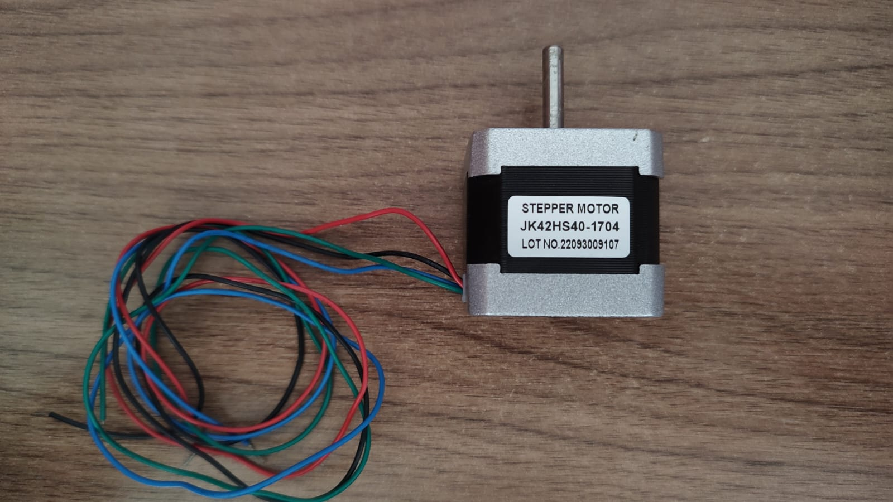
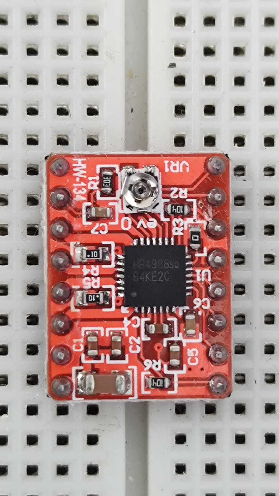
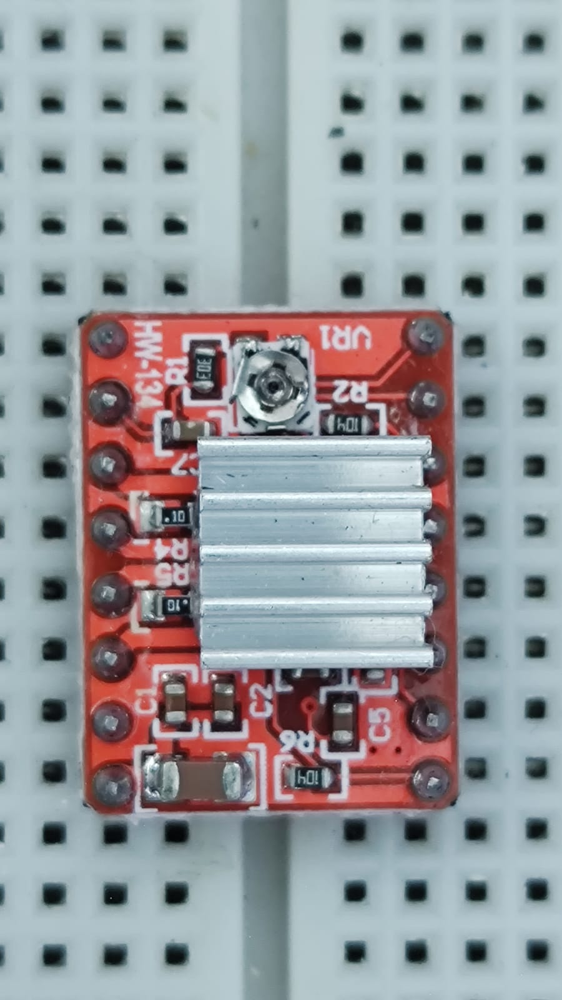
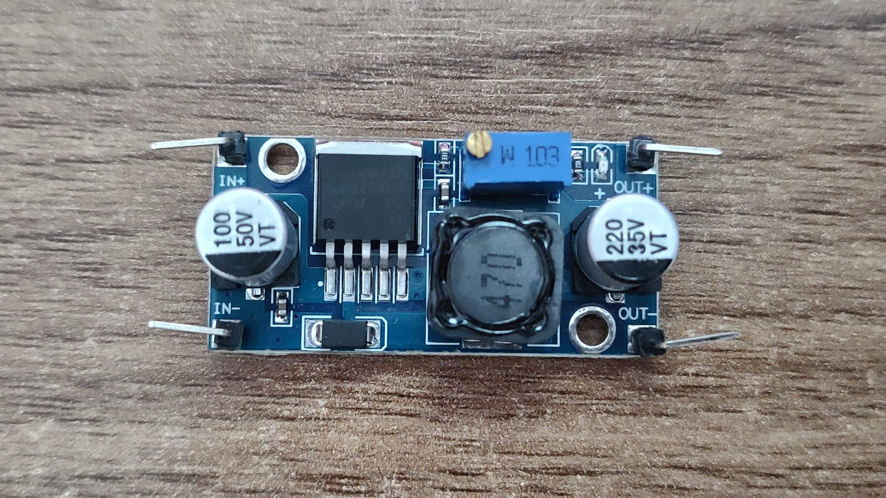
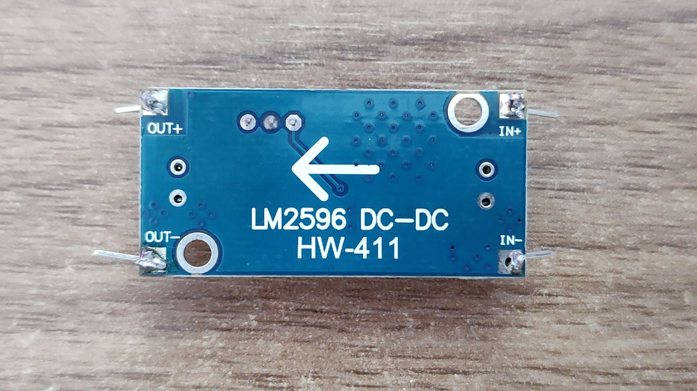
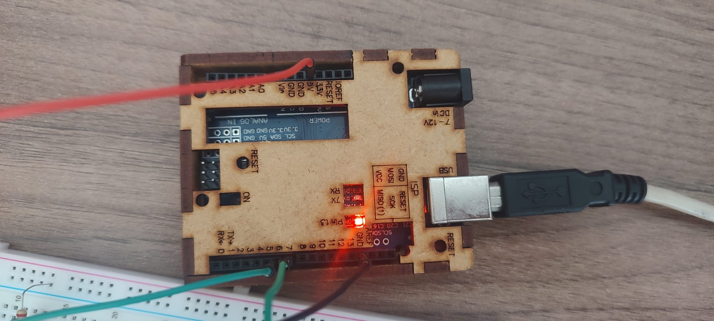

# 🚀 Teste Motor de Passo

## 📌 Índice
- [🚀 Teste Motor de Passo](#-teste-motor-de-passo)
  - [📌 Índice](#-índice)
  - [📌 Descrição](#-descrição)
    - [🎯 Motor de Passo (Stepper Motor) Nema 17 - 17HS4440 - JK42HS40-1704](#-motor-de-passo-stepper-motor-nema-17---17hs4440---jk42hs40-1704)
      - [📍 O que é um Motor de Passo?](#-o-que-é-um-motor-de-passo)
      - [🔧 Especificações do Motor](#-especificações-do-motor)
    - [🎯 Como Funciona?](#-como-funciona)
        - [🔄 Tipos de Movimento](#-tipos-de-movimento)
    - [📌 Driver A4988](#-driver-a4988)
      - [🔹 Características Principais](#-características-principais)
      - [📌 Pinos Principais](#-pinos-principais)
      - [🔄 Modos de Microstepping](#-modos-de-microstepping)
      - [⚙️ Calibração do Driver](#️-calibração-do-driver)
        - [📌 Onde:](#-onde)
    - [📌 Regulador de Tensão LM2596](#-regulador-de-tensão-lm2596)
      - [🔹 Características](#-características)
    - [📌 Fonte de Alimentação](#-fonte-de-alimentação)
  - [📌 Imagens dos Materiais](#-imagens-dos-materiais)
  - [📌 Requisitos](#-requisitos)
  - [📌 Instalação](#-instalação)
  - [📌 Uso](#-uso)

---

## 📌 Descrição  

### 🎯 Motor de Passo (Stepper Motor) Nema 17 - 17HS4440 - JK42HS40-1704  

> **IMPORTANTE:** Verifique se você está utilizando o motor de passo correto. Consulte as informações no [Datasheet do Motor Nema 17](Datasheet%20-%2017HS4401S.pdf).  

#### 📍 O que é um Motor de Passo?  

Um **motor de passo** é um motor elétrico que se move em pequenos passos fixos.  
Diferente de motores comuns, que giram continuamente, ele avança em **passos discretos**, permitindo um controle preciso da posição e velocidade.  

🔹 **Aplicações:** Impressoras 3D, CNCs, robôs, automação industrial.  
🔹 **Vantagens:** Controle exato sem necessidade de sensores adicionais.  

#### 🔧 Especificações do Motor  

- **Tensão:** 3,4V  
- **Corrente por fase:** 1,7A  
- **Torque:** 40 N.cm  
- **Passo por volta:** 200 (1,8° por passo)  
- **Eixo:** 5mm de diâmetro  

<p align="center">
  
</p>

---

### 🎯 Como Funciona?  

O motor de passo tem várias bobinas organizadas em fases. Quando uma corrente passa por essas bobinas, o rotor gira em pequenos passos.  

##### 🔄 Tipos de Movimento  

1️⃣ **Passo Completo**: O motor se move um passo por vez (maior torque).  
2️⃣ **Meio Passo**: Cada passo é dividido em dois, melhorando a precisão.  
3️⃣ **Micro Passo**: Movimentos suaves e silenciosos, comuns em CNCs e impressoras 3D.  

---

### 📌 Driver A4988

O **Driver A4988** é um módulo projetado para controlar motores de passo bipolares, oferecendo recursos avançados como microstepping para movimentos mais suaves e precisos. É amplamente utilizado em projetos de automação, como impressoras 3D e máquinas CNC.

#### 🔹 Características Principais

- **Tensão de operação lógica:** 3V a 5,5V
- **Tensão de operação do motor:** 8V a 35V
- **Corrente máxima por bobina:** 2A (pico de até 4A)
- **Modos de microstepping:** Passo completo, 1/2, 1/4, 1/8 e 1/16
- **Proteções integradas:** Sobrecorrente e sobretemperatura

<p align="center">
  
  
</p>

#### 📌 Pinos Principais

| Pino   | Função                             |
|--------|------------------------------------|
| VMOT   | Alimentação do motor (8V a 35V)    |
| GND    | Terra                              |
| VDD    | Alimentação lógica (3V a 5,5V)     |
| STEP   | Pulso para movimentar o motor      |
| DIR    | Define a direção de rotação        |
| MS1    | Configuração de microstepping      |
| MS2    | Configuração de microstepping      |
| MS3    | Configuração de microstepping      |
| ENABLE | Ativa/Desativa o driver            |
| RESET  | Reinicia o driver                  |
| SLEEP  | Coloca o driver em modo de baixo consumo |

#### 🔄 Modos de Microstepping

Os pinos **MS1**, **MS2** e **MS3** determinam a resolução dos passos do motor:

| MS1 | MS2 | MS3 | Resolução     |
|-----|-----|-----|---------------|
| 0   | 0   | 0   | Passo Completo|
| 1   | 0   | 0   | Meio Passo    |
| 0   | 1   | 0   | 1/4 de Passo  |
| 1   | 1   | 0   | 1/8 de Passo  |
| 1   | 1   | 1   | 1/16 de Passo |

#### ⚙️ Calibração do Driver

Para garantir o funcionamento adequado e evitar danos ao motor ou ao driver, é essencial calibrar a corrente fornecida ao motor ajustando o trimpot presente no módulo. A tensão de referência (**V<sub>ref</sub>**) pode ser calculada pela fórmula:

$$
V_{ref} = I_{motor} \times 8 \times R_{sense}
$$

##### 📌 Onde:
$ V_{ref}  → $ Tensão de referência que deve ser ajustada no trimpot  
$I_{motor} → $ Corrente desejada para o motor  
$R_{sense} → $ Resistência de detecção de corrente do driver (geralmente 0,05Ω ou 0,1Ω)

---

### 📌 Regulador de Tensão LM2596  

O **LM2596** é um regulador de tensão **Step-Down**, usado para reduzir a tensão de entrada e proteger os componentes do circuito.  

#### 🔹 Características  

- **Entrada:** 4V a 40V  
- **Saída:** 1,25V a 37V ajustável  
- **Corrente máxima:** 3A  
- **Eficiência:** Até 92%  

<p align="center">
  
  
</p>

---

### 📌 Fonte de Alimentação  

A fonte de alimentação utilizada no circuito é:

- **Saída:** 12V 3A  
- **Entrada:** 100-240V ~50/60Hz  

Esta fonte alimentará tanto o **LM2596** quanto o **Driver A4988**, garantindo uma corrente adequada para o motor de passo.

---

## 📌 Imagens dos Materiais  

Aqui estão os principais componentes utilizados no projeto:  

| Componente  | Imagem |
|-------------|--------|
| **Motor Nema 17** |  |
| **Driver A4988** |  |
| **Regulador LM2596** |  |
| **Arduino** |  |

---

## 📌 Requisitos  

✔ **Arduino Uno**  
✔ **Motor de Passo Nema 17**  
✔ **Driver A4988**  
✔ **Regulador de Tensão LM2596**  
✔ **Fonte de Alimentação 12V 2A**  
✔ **Jumpers e Fios**  

---

## 📌 Instalação  

1️⃣ Conecte o **Motor Nema 17** ao Driver A4988.  
2️⃣ Ligue o **Driver A4988** ao Arduino:  
   - `DIR` → **Pino 8**
   - `STEP` → **Pino 9**
 
3️⃣ Regule a **tensão do LM2596** para 12V e conecte à alimentação do driver.  
4️⃣ Conecte a fonte de **12V 3A** à entrada do LM2596.  
5️⃣ Carregue o código no Arduino. 

---

## 📌 Uso  

Código básico para movimentar o motor de passo:  

```cpp
#define STEP_PIN 9
#define DIR_PIN 8

void setup() {
  pinMode(STEP_PIN, OUTPUT);
  pinMode(DIR_PIN, OUTPUT);
}

void loop() {
  digitalWrite(DIR_PIN, HIGH);  // Define a direção
  for(int i = 0; i < 200; i++) {  // 200 passos = 1 volta completa
    digitalWrite(STEP_PIN, HIGH);
    delayMicroseconds(800);
    digitalWrite(STEP_PIN, LOW);
    delayMicroseconds(800);
  }
  delay(1000);
}
