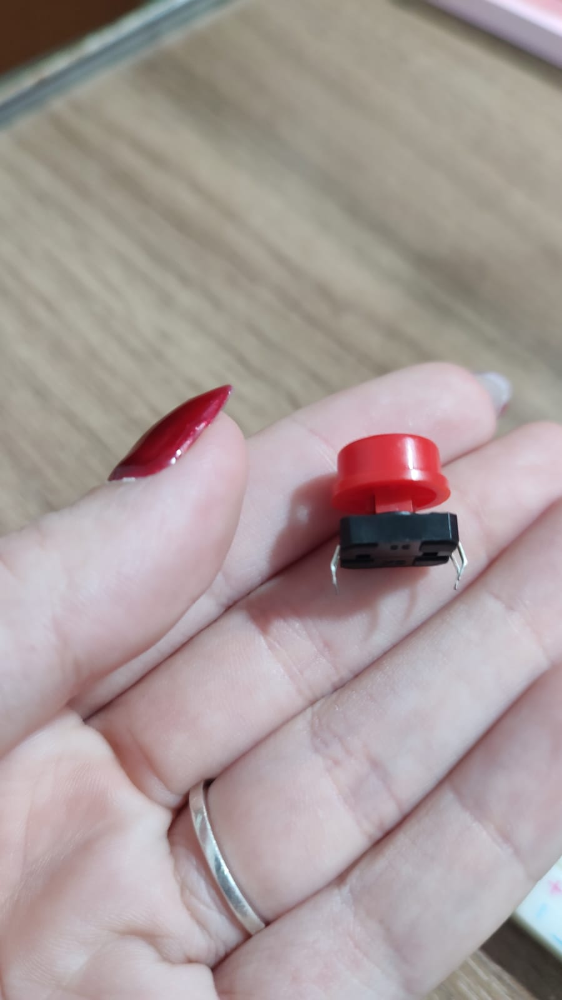
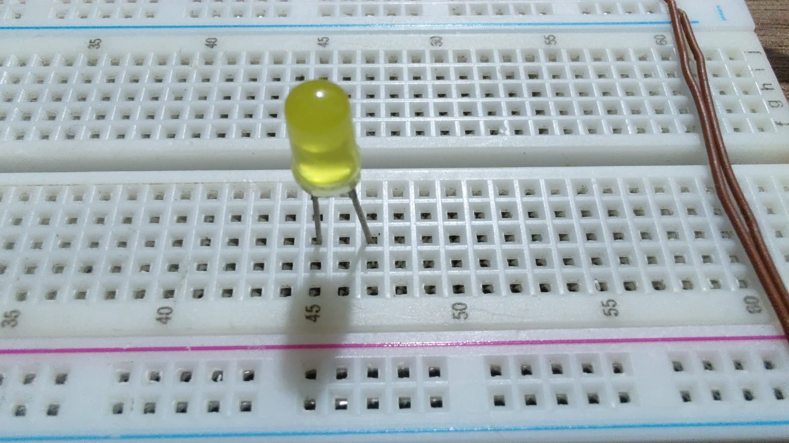
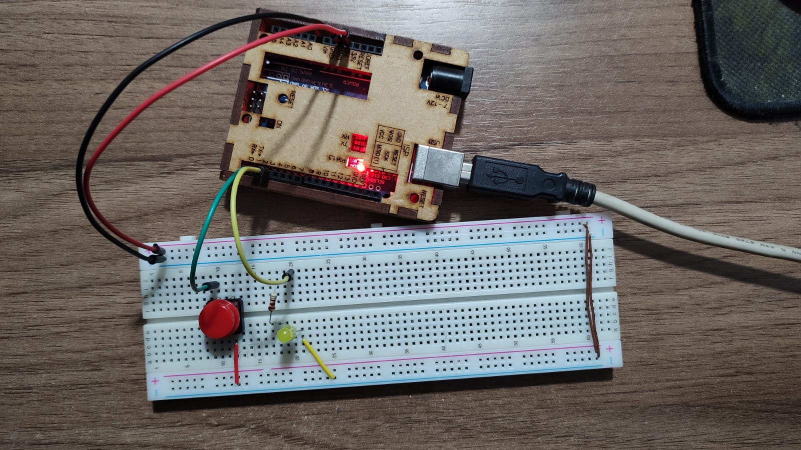

Olá,
> Venho compartilhar meu conhecimento, de forma a também deixar de fácil acesso exemplos e formas de uso de componentes, um portfólio pessoal dos meus componentes.

# 🚀 Teste Botão Pull-Up

## 📌 Índice
- [🚀 Teste Botão Pull-Up](#-teste-botão-pull-up)
  - [📌 Índice](#-índice)
  - [📌 Descrição](#-descrição)
    - [🎯 Botão com Pull-Up Interno](#-botão-com-pull-up-interno)
      - [📍 O que é Pull-Up?](#-o-que-é-pull-up)
    - [🎯 Como Funciona?](#-como-funciona)
  - [📌 Imagens dos Materiais](#-imagens-dos-materiais)
  - [📌 Requisitos](#-requisitos)
  - [📌 Instalação](#-instalação)
  - [](#)
  - [📌 Uso](#-uso)
  - [🎬 Vídeo Demonstrativo do Funcionamento](#-vídeo-demonstrativo-do-funcionamento)

---

## 📌 Descrição  

### 🎯 Botão com Pull-Up Interno  

#### 📍 O que é Pull-Up?  

Um **botão com pull-up interno** utiliza um resistor interno do Arduino para manter o pino em nível lógico alto (`HIGH`) quando o botão não está pressionado.  
Ao pressionar o botão, o pino é conectado ao **GND**, mudando o nível para baixo (`LOW`).  

🔹 **Aplicações:** Entrada de dados por botão, acionamento de funções, sistemas de controle.  
🔹 **Vantagens:** Menos componentes externos, reduz ruído elétrico e facilita a montagem.

---

### 🎯 Como Funciona?  

- Com o **pull-up interno ativado**, o pino do botão permanece em **HIGH** até que o botão seja pressionado.  
- Quando pressionado, o circuito fecha para o GND e o pino lê **LOW**.  
- Isso evita o uso de resistores externos e simplifica o circuito.  

---

## 📌 Imagens dos Materiais  

| Componente           | Imagem                                |
|----------------------|---------------------------------------|
| **Botão**            |  |
| **LED Amarelo**         |  |
| **Arduino**          |  |

---

## 📌 Requisitos  

✔ **Botão**  
✔ **Arduino Uno**  
✔ **LED**  
✔ **Resistor de 220Ω**  
✔ **Jumpers e Protoboard**  
✔ **Cabo USB**  

---

## 📌 Instalação  

1️⃣ Conecte um lado do **botão** ao pino digital `2` do Arduino.  
2️⃣ Conecte o outro lado do botão ao **GND**.  
3️⃣ Conecte o **LED** ao pino digital `3` do Arduino e ao GND com resistor de 220Ω em série.  
4️⃣ Carregue o código no Arduino.


---

## 📌 Uso  

Código básico para acionar o LED ao pressionar o botão com pull-up interno:

```cpp
#define BUTTON_PIN 2
#define LED_PIN 3

void setup() {
  pinMode(BUTTON_PIN, INPUT_PULLUP); // Ativa pull-up interno
  pinMode(LED_PIN, OUTPUT);
}

void loop() {
  if (digitalRead(BUTTON_PIN) == LOW) { // Botão pressionado
    digitalWrite(LED_PIN, HIGH);  // Acende o LED
  } else {
    digitalWrite(LED_PIN, LOW);   // Apaga o LED
  }
}
```

## 🎬 Vídeo Demonstrativo do Funcionamento

https://github.com/JoyFigueiredo/ArduinoHobby/blob/1f745939695a0515eeff5d98806e94b064bbedb4/TestesdeComponentes/TestesDeEletronicaBasica/Bot%C3%B5es/Bot%C3%A3oPull-Up/imagensEvideos/VideoFuncionandoBot%C3%A3o