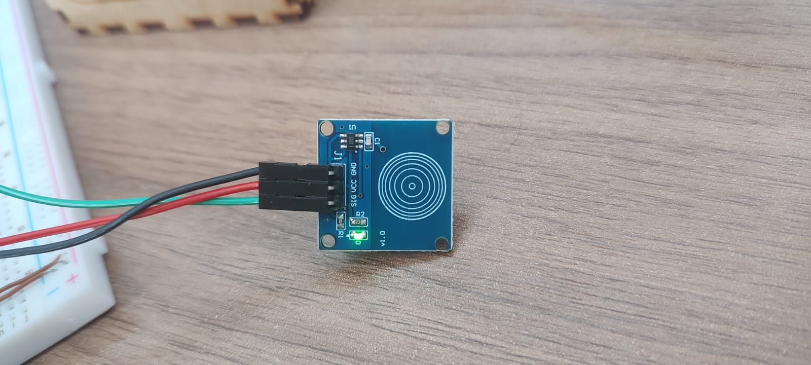
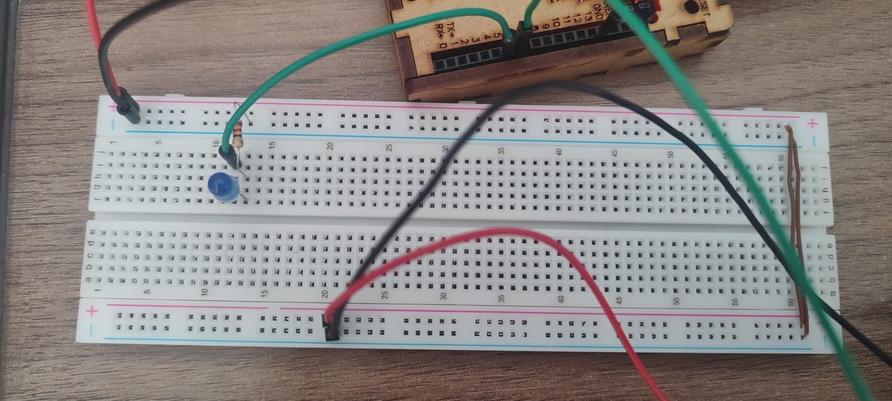

Olá,
> Venho compartilhar meu conhecimento, de forma a também deixar de fácil acesso exemplos e formas de uso de componentes, um portfólio pessoal dos meus componentes.

# 🚀 Teste Sensor de Toque

## 📌 Índice
- [🚀 Teste Sensor de Toque](#-teste-sensor-de-toque)
  - [📌 Índice](#-índice)
  - [📌 Descrição](#-descrição)
    - [🎯 Sensor de Toque TTP223](#-sensor-de-toque-ttp223)
      - [📍 O que é um Sensor de Toque?](#-o-que-é-um-sensor-de-toque)
    - [🎯 Como Funciona?](#-como-funciona)
  - [📌 Imagens dos Materiais](#-imagens-dos-materiais)
  - [📌 Requisitos](#-requisitos)
  - [📌 Instalação](#-instalação)
  - [📌 Uso](#-uso)
  - [🎬 Vídeo Demonstrativo do Funcionamento](#-vídeo-demonstrativo-do-funcionamento)

---

## 📌 Descrição  

### 🎯 Sensor de Toque TTP223  

#### 📍 O que é um Sensor de Toque?  

O **sensor de toque** TTP223 é um sensor capacitivo que detecta a variação de capacitância quando há contato físico com a superfície de sensibilidade, acionando um sinal digital.  
É muito usado em dispositivos interativos, como teclados sensíveis ao toque e interruptores eletrônicos.  

🔹 **Aplicações:** Teclados sensíveis ao toque, sistemas de alarme, controle de iluminação.  
🔹 **Vantagens:** Não requer partes móveis, baixo consumo de energia.  

---

### 🎯 Como Funciona?  

O sensor TTP223 usa um eletrodo capacitivo para detectar a aproximação ou o toque de um dedo. Quando o toque é detectado, ele gera um sinal lógico para acionar o sistema desejado (como acionar um LED).

---

## 📌 Imagens dos Materiais  

Aqui estão os principais componentes utilizados no projeto:  

| Componente            | Imagem                                |
|-----------------------|---------------------------------------|
| **Sensor de Toque**    |  |
| **LED Azul**           |  |
| **Arduino**            |  |

---

## 📌 Requisitos  

✔ **Sensor de Toque TTP223**  
✔ **Arduino Uno**  
✔ **LED**  
✔ **Resistor de 220Ω**  
✔ **Jumpers e Protoboard**  
✔ **Cabo USB**  

---

## 📌 Instalação  

1️⃣ Conecte o **Sensor de Toque** ao pino digital `7` do Arduino.  
2️⃣ Conecte o **LED** ao pino digital `6` do Arduino e o GND com um resistor de 220Ω em série.  
3️⃣ Carregue o código no Arduino.

---

## 📌 Uso  

Código básico para acionar o LED ao detectar toque:

```cpp
#define TOUCH_PIN 7
#define LED_PIN 6

void setup() {
  pinMode(TOUCH_PIN, INPUT);
  pinMode(LED_PIN, OUTPUT);
}

void loop() {
  if(digitalRead(TOUCH_PIN) == HIGH) {
    digitalWrite(LED_PIN, HIGH);  // Acende o LED
  } else {
    digitalWrite(LED_PIN, LOW);   // Apaga o LED
  }
}
```

## 🎬 Vídeo Demonstrativo do Funcionamento

https://github.com/JoyFigueiredo/ArduinoHobby/assets/87450298/07a08eba-10fd-4d6d-8f5a-3f352e77d485
