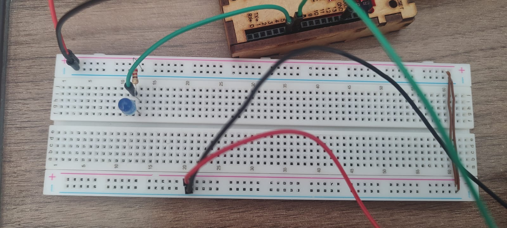
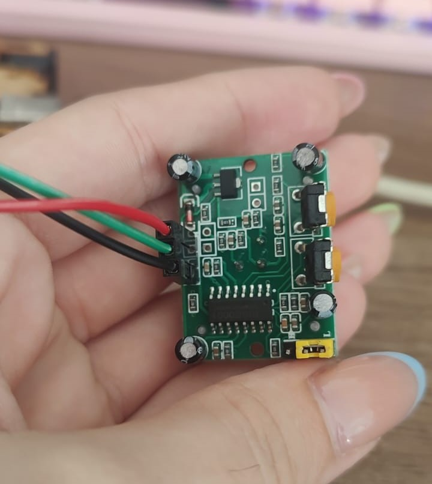

# Teste de Componentes

## Índice
- [Descrição](#descrição)
- [Requisitos](#requisitos)
- [Instalação](#instalação)
- [Uso](#uso)
- [Inicialização](#inicialização)

## Descrição

Este projeto tem como objetivo testar o funcionamento do sensor de presença HC-SR501 e o acionamento de um LED quando o sensor detectar movimento. O sensor PIR é utilizado para detectar a presença de movimento em uma área e acionar um LED correspondente.

## Requisitos

Para executar este projeto, você precisará de:

- Arduino (por exemplo, Arduino Uno)
- Sensor de presença HC-SR501 PIR
- LED
- Resistor de 220Ω para o LED
- Pulldown resistor de 10kΩ para o sensor (opcional, mas recomendado)
- Jumpers e protoboard
- Cabo USB para conectar o Arduino ao computador
- Software Arduino IDE

## Instalação

1. **Instale o Arduino IDE**:
   - Baixe e instale o Arduino IDE a partir do [site oficial](https://www.arduino.cc/en/software).

2. **Baixe o Código**:
   - Clone este repositório ou baixe o código manualmente.
     ```bash
     git clone https://github.com/seu-usuario/teste-componentes.git
     ```

3. **Abra o Código no Arduino IDE**:
   - Abra o arquivo `.ino` no Arduino IDE.

4. **Conecte o Arduino ao Computador**:
   - Conecte seu Arduino ao computador usando um cabo USB.

5. **Configure o Arduino IDE**:
   - Selecione a placa correta (por exemplo, Arduino Uno) em **Ferramentas > Placa**.
   - Selecione a porta correta em **Ferramentas > Porta**.

6. **Faça o Upload do Código**:
   - Clique no botão de upload (seta para a direita) para carregar o código no Arduino.

## Uso

1. **Conecte o Sensor e o LED**:
   - **Sensor**: Conecte o pino de saída do sensor ao pino digital `7` do Arduino.
   - **LED**: Conecte o anodo do LED ao pino digital `6` do Arduino e o catodo ao GND, com um resistor de 220Ω em série.
   - **Pulldown Resistor**: Conecte um resistor de 10kΩ entre o pino de saída do sensor e o GND.

2. **Monitore o Serial**:
   - Abra o monitor serial no Arduino IDE em **Ferramentas > Monitor Serial** para ver as leituras do sensor.

3. **Testar o Sensor**:
   - Coloque o sensor em um ambiente estático e observe o comportamento do LED e as mensagens no monitor serial.

## Inicialização

Para iniciar o monitoramento, siga estas etapas no Arduino IDE:

1. **Conectar e Subir o Código**:
   ```bash
   # Conectar o Arduino ao computador e subir o código
   # No Arduino IDE, clique em Upload para carregar o código no Arduino.

## Imagens dos Materiais





